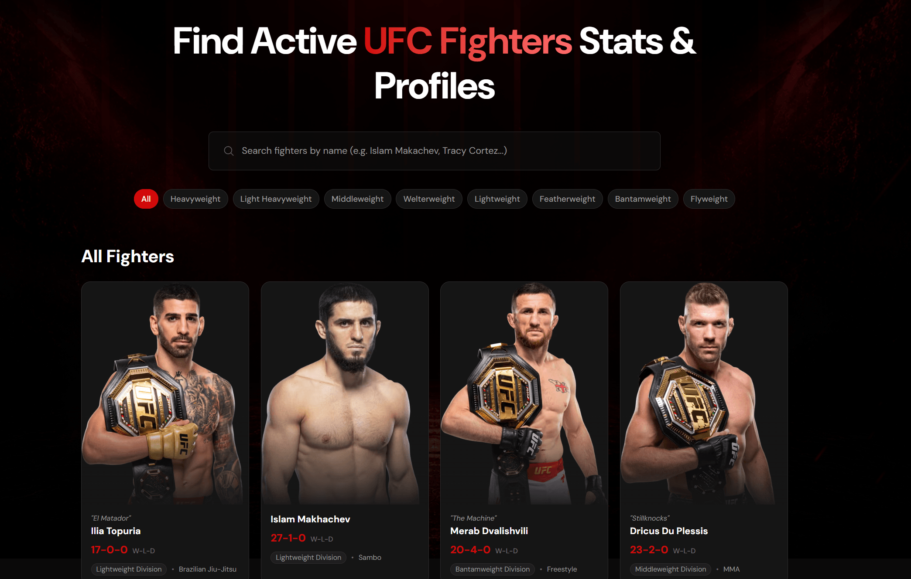
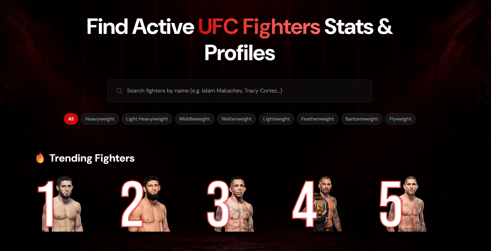
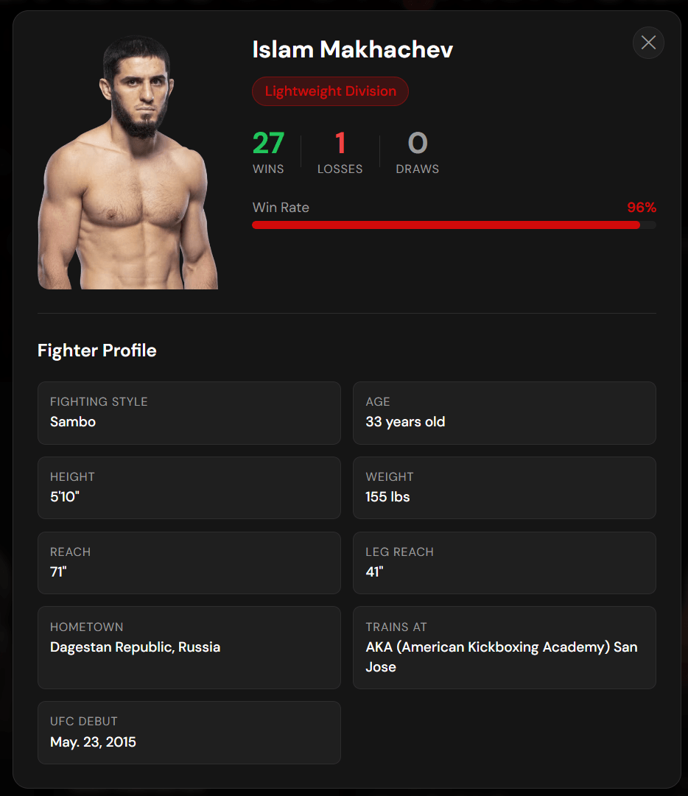

# UFC Fighter Search

A React web app for searching and exploring active UFC fighter profiles. Built with the free Octagon API for fighter data and Appwrite as the cloud database powering the trending-search feature.

> **Live demo:** _https://ufc-fighter-search.vercel.app/_ &nbsp;·&nbsp; **Repo:** this one

---
## Screenshots



| Trending Fighters | Fighter Detail Modal |
|---|---|
|  |  |
## Features

- **Instant search** — debounced 500ms input that filters the active UFC roster by name
- **Trending fighters** — every search increments a counter in Appwrite; the top 5 most-searched fighters are surfaced on the homepage in real time across all visitors
- **Fighter detail modal** — click any card for full stats: record, win rate, height, reach, hometown, fighting style, UFC debut
- **Weight class filters** — browse all eight UFC divisions
- **Win rate visualisation** — animated bar showing each fighter's win percentage
- **Responsive** — designed mobile-first; works on phones, tablets, and desktops
- **Resilient** — graceful handling of loading, error, and empty states; image fallbacks for fighters without photos

---

## Tech stack

| Layer | Choice |
|---|---|
| UI | React 18, JSX, function components + hooks |
| Build tool | Vite 6 |
| Styling | Tailwind CSS v4 with custom design tokens |
| Backend | Appwrite Cloud (free tier) for the database |
| Data | [Octagon API](https://github.com/valish/mma-api) — free, public, no key required |
| Deploy target | Vercel (CI/CD via GitHub) |

---

## Getting started locally

```bash
# 1. Clone
git clone https://github.com/<your-username>/ufc-fighter-search.git
cd ufc-fighter-search

# 2. Install
npm install

# 3. Set up environment variables
cp .env.example .env.local
# then open .env.local and fill in your Appwrite IDs

# 4. Run the dev server
npm run dev
```

The app will be live at [http://localhost:5173](http://localhost:5173).

---

## Appwrite setup

The trending feature needs a free Appwrite account. After creating one:

1. Create a project at [cloud.appwrite.io](https://cloud.appwrite.io) and copy the **Project ID**
2. Create a database and copy the **Database ID**
3. Create a collection named `fighter_searches` with the following attributes:

   | Attribute | Type | Size | Required |
   |---|---|---|---|
   | `searchTerm` | String | 255 | Yes |
   | `count` | Integer | — | Yes |
   | `fighter_id` | String | 64 | Yes |
   | `fighter_name` | String | 255 | Yes |
   | `fighter_image_url` | String | 2000 | Yes |
   | `weight_class` | String | 64 | No |

4. In the collection's **Settings → Permissions**, add **Role: Any** with all permissions checked
5. Under **Project → Settings → Platforms**, add a Web platform with hostname `localhost` (and your production URL once deployed)
6. Paste your IDs into `.env.local`

---

## Project structure

```
public/
├── background.png          // hero pattern
├── no-fighter.svg          // fallback when a fighter has no photo
├── octagon.svg             // favicon
└── search.svg              // search icon

src/
├── components/
│   ├── FighterCard.jsx     // single card in the grid
│   ├── FighterModal.jsx    // detail popup with full stats
│   ├── Search.jsx          // search input
│   └── Spinner.jsx         // loading indicator
├── App.jsx                 // root component, owns all state and fetching
├── appwrite.js             // Appwrite client + trending search functions
├── index.css               // Tailwind + custom styles
└── main.jsx                // React entry point
```

---

## Notable implementation details

**Debounced search.** Without debouncing, every keystroke fires an API request. Typing "Jon Jones" would be 9 requests. The `useDebounce` hook from `react-use` waits 500ms after the last keystroke before triggering a fetch — roughly an 85% reduction in network calls for a typical search.

**Upsert pattern in Appwrite.** Each search either creates a new document with `count: 1` or increments the existing one's count. Implemented in `appwrite.js` as a `listDocuments` lookup followed by either `updateDocument` or `createDocument`.

**Denormalised cache for trending.** Rather than re-fetching fighter data from the Octagon API to render the trending section, the search-count document also stores the fighter's name and image URL. Trade-off: cached photos go stale if the API updates them, but in exchange the trending UI renders without a second roundtrip.

**Type coercion fix.** The Octagon API returns wins/losses/draws as strings (`"21"` not `21`). The win-rate calculation initially used `wins + losses + draws`, which was concatenating strings (`"2110"`) instead of summing them. Wrapped each value in `Number()` with a `|| 0` fallback so the maths is correct.

**Decoupled UI states.** The fighter grid handles four explicit states — loading, error, empty, success — each with its own visual treatment, so users always know what's happening.

---

## What I'd do differently next time

- **TypeScript** — the fighter object has many optional fields, and a few `undefined` bugs would have been caught earlier with type checking
- **URL state** — currently a refresh wipes the search and filter. React Router with query params (`?search=jones&division=heavyweight`) would make the URL shareable
- **Pagination or virtualisation** — the current implementation fetches all ~600 fighters at once. Fine at this scale, but I'd want server-side pagination for anything bigger

---

## How I built this

I'm a recent software engineering graduate building personal projects to strengthen my frontend and API skills.

This project started from a movie search app concept, but I rebuilt it around something I’m personally interested in: UFC. I adapted the structure, connected it to a UFC fighter API, and added features such as fighter search, weight-class filtering, fighter detail views, and better handling for inconsistent API data.

The main goal was to practise building a real React project from start to finish, including components, state, API calls, loading states, error handling, and clean UI structure.

---

## License

MIT
